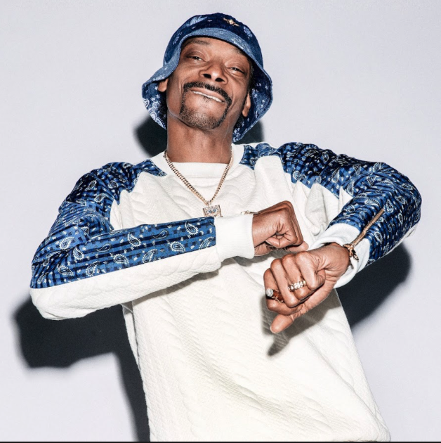
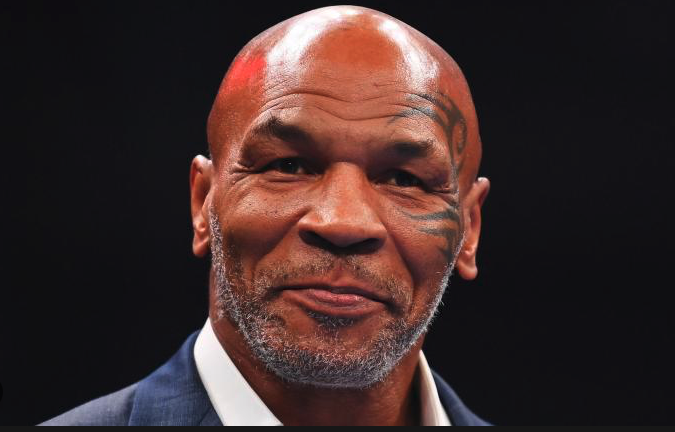

# **FameChain dApp**

## ***Capstone Project 3 for SMU Fintech***

## Table of Contents
* [Background](#background)
* [Overview](#overview)
* [Features](#features)  
* [How it Works](#how-it-works)
* [Getting Started](#getting-started)
* [Smart Contract](#smart-contract)
* [Technologies Used](#technologies-used)  
* [Team Members](#team-members)

### Background:

FameChain emerges as a trailblazing Digital Asset Exchange, drawing a vibrant spectrum of assets and attracting a mosaic of renowned and burgeoning coin traders. Emboldened by our burgeoning success, the helm at FameChain is set to harness this momentum, leveraging our burgeoning popularity and ample marketing resources to propel FameChain to unprecedented heights.

In our quest for excellence, we've forged connections with luminaries well-versed in the cryptosphere, esteemed personalities who hold stakes in the FameChain Exchange. Together, we aim to orchestrate a sweeping online and television campaign, propelling our visibility to stratospheric levels and igniting a wildfire of growth.

But here's where you, our esteemed exchange members, come into play. We're entrusting you with the pivotal task of selecting the face of our campaign. Through a groundbreaking blockchain voting system, each member receives a voice—a single vote that holds the power to shape our collective destiny. With 100% participation, we envision a future brimming with untapped potential, where growth and liquidity converge harmoniously.

By harnessing the immutable power of blockchain technology, we ensure the integrity of each vote, safeguarding against manipulation and ensuring a fair and transparent process. Together, let's chart the course for FameChain's future, guided by the collective wisdom of our community.

Now, without further ado, let's meet the nominees vying for the prestigious spotlight in our campaign

---

- ***Elon Musk*** - *CEO and Chairman, TechnoKing of Tesla Motors and SpaceX*

Campaign Slogan:  **"DogeCoin to the Moon!"**
---
---
- ***Snoop Dogg*** - *aka Calvin Cordozar Broadus, Jr., OG of Long Beach and World Famous American Rapper*

Campaign Slogan:  **"Scooping Up That Bizzy, Making you Dizzy"**
---
---
- ***Mike Tyson*** - *former Boxing Heavyweght World Champion and Actor*

Campaign Slogan:  **"The Champ of Knocking Out Cash"**
--- 
---
- ***Billie Eilish*** - *world famous performer and multiple Grammy, AMA, VMA Awards winner*

Campaign Slogan:  **"Bitcoin's Bad Girl"**
---
---
- ***Paris Hilton*** - *reality TV star and and heiress to the Hilton Group Hotel fortune*

Campaign Slogan:  **"That's Hot"**
---
What You're Creating:

We want to begin the assignment by building a python file in VS Code that will lauch a Streamlit Voting Interface where our exchange members will be able to enter their respective digital wallet codes and securely vote for an small exchange fee.  Votes will be tallied as they arrive in through the application, and we intend to name a winner once we have achieved a quorum result within a specified voting time period.  Results will be definitive and binding, and FameChain will move forward with an all-encompassing global campaign with our new celebrity spokesperson.

We plan to simulate the exchange votes

Instructions

The steps for this challenge are broken out into the following sections:

* Build a Front-End Python script that will create a Streamlit application
* Build a ReMix solution file that will accept digital wallet IDs and payments to secure simulated exchange member votes
* Tabulate the results via Streamlit and name a winner (Celebrity Spokesperson), then tabulate funds raised for the exchange by the interactive vote.
## Overview
The FameChain dApp is a decentralized application (dApp) built on the Ethereum blockchain, designed to elect a crypto ambassador from a pool of celebrity candidates through a fair and transparent voting process.

## Features
- Decentralized Voting: Utilizes smart contracts to facilitate a secure and transparent voting process, ensuring the integrity of the election.
- Celebrity Candidates: Offers a diverse selection of celebrity candidates, each with their own unique slogan and image.
- Blockchain Integration: Integrates with the Ethereum blockchain, allowing users to cast their votes using their Ethereum wallet addresses.
- Real-Time Results: Displays real-time updates on the voting results, including total votes for each candidate and the current leading candidate.
- Engaging User Interface: Provides an intuitive and visually appealing user interface, featuring candidate images and slogans.

## How it Works
1. Welcome Page: Users are greeted with an introduction to the FameChain dApp and its purpose.
2. Candidates Page: Users can view the list of celebrity candidates along with their images and slogans.
3. Vote Page: Users can select their preferred candidate and cast their vote using their Ethereum wallet address.
4. Results Page: Users can view the real-time voting results, including a dynamic pie chart illustrating the distribution of votes among candidates. The page also displays the total votes for each candidate and announces the winner once the voting period ends.

## Getting Started
To run the FameChain dApp locally:

1. Install Dependencies: Make sure you have Python installed on your system. Install the required Python libraries listed in the requirements.txt file using pip.

         || pip install -r requirements.txt ||

2. Run the Application: Execute the Python script famechain.py to launch the FameChain dApp.

         || streamlit run famechain.py ||

3. Connect to Ganache: Ensure that you have Ganache installed and running as your local blockchain server. Configure Metamask to connect to Ganache to interact with the blockchain.

4. Start Voting: Access the FameChain dApp through your web browser and start voting for your favorite celebrity candidate!

## Smart Contract
The smart contract FameChainBallot.sol, pragma 0.8.0, defines the logic for the FameChain voting system. It contains functions to add candidates, cast votes, retrieve voting results, and more. The contract is deployed on the Ethereum blockchain and interacts with the dApp to facilitate the voting process.
*Note* Make sure to compile in Solidity Version 0.8.0

## Technologies Used
* Python: Used for developing the frontend of the dApp using the Streamlit library.
* Solidity: Used for writing the smart contract logic.
* Ethereum Blockchain: Used for deploying the smart contract and recording the voting transactions.
* Ganache: Used as the local blockchain server for testing and development.
* Metamask: Used as a browser extension to interact with the Ethereum blockchain.

## ***Team Members***
### Jahun Moayedzadeh
### Daniela Catalan
### Jonathan Frazure

